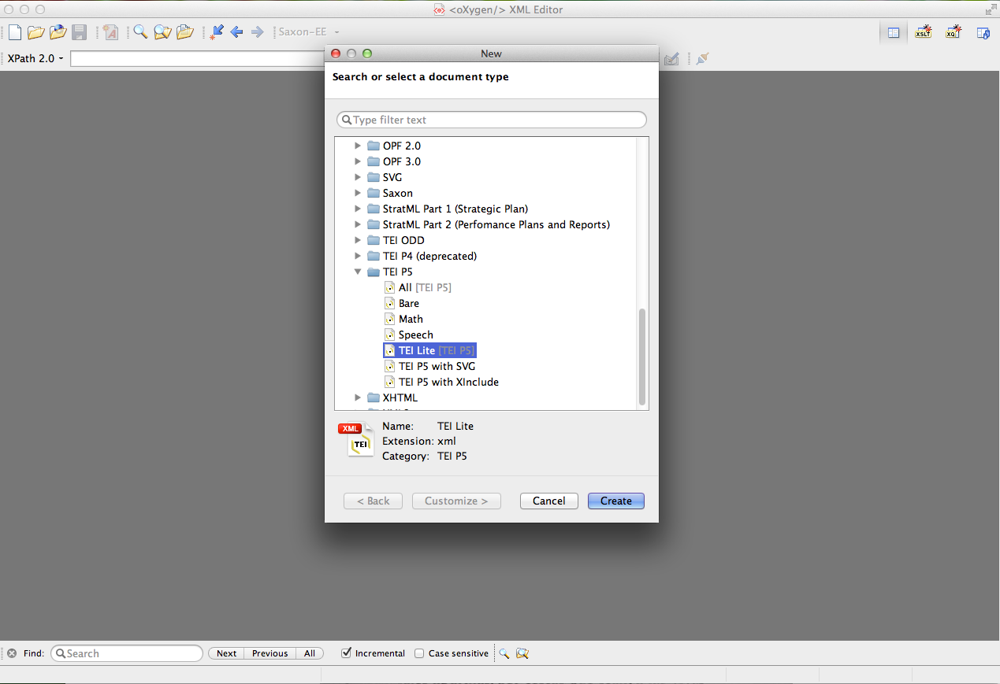
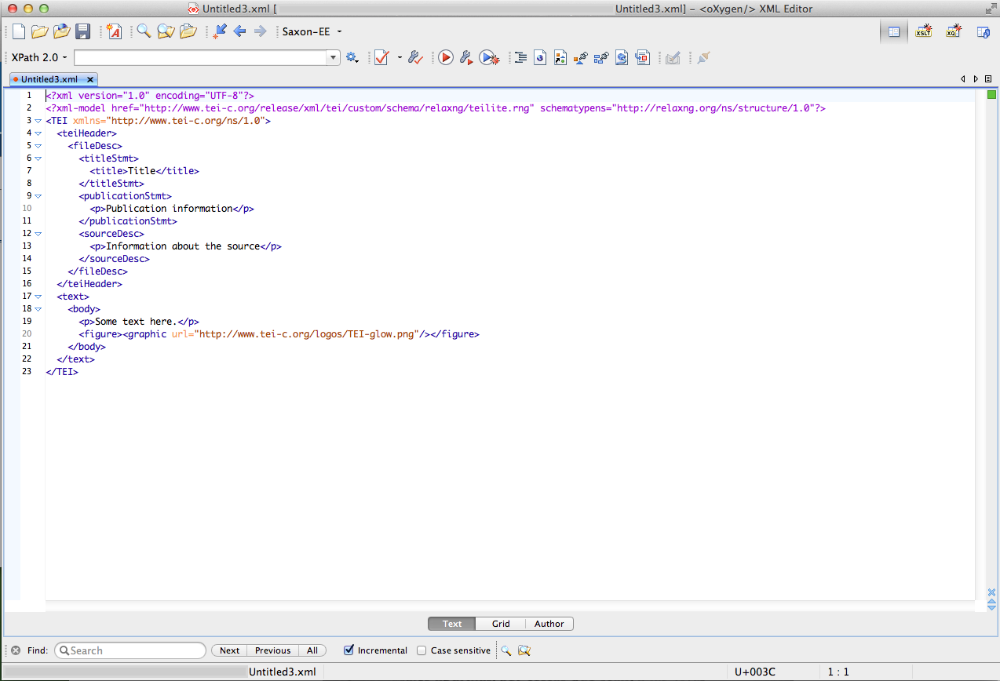
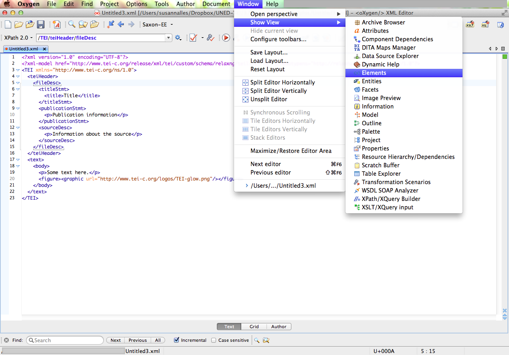
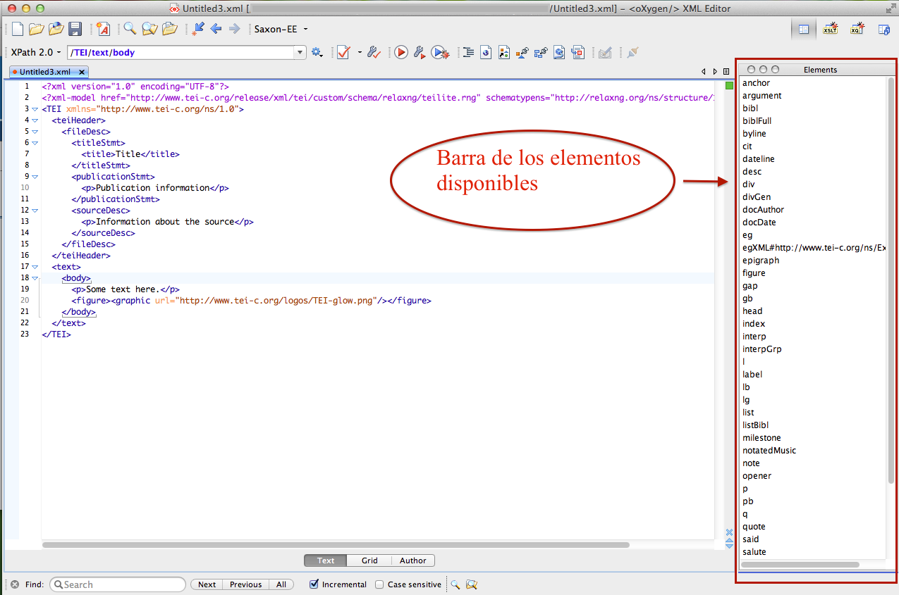

# Creación de un documento TEI

Este ejercicio es muy simple y consiste en la creación de un documento TEI. Para llevarlo a cabo utilizaremos el programa [Oxygen](https://www.oxygenxml.com/), aunque recordar que un documento XML puede editarse con cualquier editor de textos ([XML Copy Editor](https://xml-copy-editor.sourceforge.io/), [Atom](https://atom.io/), [JEdit](http://www.jedit.org/), [Notepad](https://notepad-plus-plus.org/) etc.).

1. En primer lugar, crearemos un documento TEI mínimo, siguiendo el esquema llamado TEI Lite. Para ello, abrid vuestro programa oXygen y, en el menú superior, elegid: 

```File> New > Framework templates > TEI P5 > TEI Lite```



2. Os aparecerá en la pantalla, un documento con una estructura mínima: el prólogo XML, un elemento raíz <TEI> con su espacio de nombre, y los dos elementos principales: <teiHeader> y <text>. La estructura que aparece constituye la serie de elementos obligatorios para que este documento sea válido. 



Para trabajar con oXygen os recomiendo que utilicéis la vista lateral de los elementos disponibles. Para ello, en el menú superior clicad en: 

```Window > Show View > Elements```





3. Ahora, podéis hacer algunas pruebas incluyendo algunas informaciones mínimas:

-	en el <teiHeader> podéis señalar los datos de vuestro documento:
	- 	 <titleStmt>: el título de vuestro archivo digital
	- 	 <author>: vuestro nombre 
	- 	 <publicationStmt>: la información "editorial", en este caso podéis poner las informaciones de este módulo que estáis estudiando.
- En el cuerpo del documento `text > body > p` podéis escribir vuestro primer párrafo y, un título (`<head>`). 

4. En fin, es importante que comprobéis si vuestro documento está bien formado, es decir, si sigue la sintaxis establecida por el mismo lenguaje XML. oXygen ofrece un simple método de comprobación que facilita esta operación. Puede hacerse de dos maneras, la primera y más rápida es la que aparece en la imagen: el pequeño icono con el documento y la V permite comprobar que el documento esté bien formado. Otra manera sería siguiendo estos pasos desde el menú superior:

```Document > Validate > Check Wellformedness```


5. Por último, deberéis comprobar que vuestro documento es válido según el esquema TEI Lite que es, en esta ocasión, el que os marca las pautas de marcado para este documento. El mismo icono ofrece la opción de validar, como se ve en la imagen, aunque también se puede acceder a la misma operación a través de: 

```Document > Validate > Validate```


