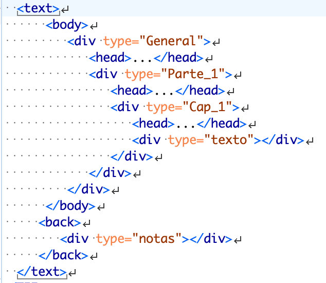
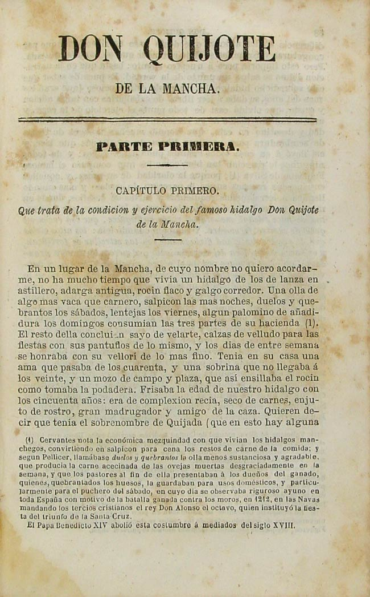

# Codificación de un texto en prosa (Quijote)

Este ejercicio consiste en el marcado de un texto en prosa, concretamente, el inicio de la novela de *El Quijote* en una edición facsímil que se halla en la Biblioteca Virtual Miguel de Cervantes:


[Miguel de Cervantes], *El ingenioso hidalgo don Quijote de la Mancha*, compuesto por Miguel de Cervantes Saavedra; edición ilustrada con las notas de Pellicer, Clemencín y otros, Madrid: Lib. Española; Barcelona: Plus Ultra, 1857. <http://bib.cervantesvirtual.com/FichaObra.html?Ref=14052&portal=0>

Este ejercicio se compone de tres secciones:

1. El enunciado de la Tarea
2. El texto a codificar
3. La imagen del texto

## 1. Enunciado:

Vuestro trabajo será codificar el texto de la imagen tal y como aparece, como si tuvierais que realizar una edición digital de ese texto.

Deberéis señalar los elementos que se indicarán a continuación y el resultado deberá ser un fichero bien formado y válido que colgaréis en vuestro apartado de “Tareas”.

**1.** Creación de un documento TEI-XML. Para ello, podéis refrescar la memoria [aquí](https://github.com/tthub-repo/ejercicios/blob/master/3.Creacion-doc-tei.md). Podéis utilizar el esquema de TEI All, pues marcaremos algunos nombres de persona y de lugar. Como siempre, para llevar a cabo el ejercicio podéis realizarlo con el programa oXygen.

**2.** Una vez creado el documento TEI-XML, estableced los siguientes elementos en su interior:

* En la sección del `<TeiHeader>` añadiremos el autor y el título del fichero digital y la información de la fuente original:

  * en `<titleStmt>` [`/TEI/teiHeader/fileDesc/titleStmt`] indicaréis en `<title>` el título del ejercicio: “Tema 6: marcado de un documento prosa - Inicio del Don Quijote” y en <author> vuestro nombre.
  * en `<sourceDesc>` [`/TEI/teiHeader/fileDesc/sourceDesc`] indicaréis la referencia bibliográfica de la edición facsímil anteriormente citada. Para ello, deberéis eliminar el elemento `<p>` que os aparece por defecto, y incluir el elemento `<bibl>`; en su interior irá la referencia completa. Podéis utilizar los siguientes elementos:
`<title>`, `<author>`, `<pubPlace>`, `<publisher>`, `<date>`. Tanto el lugar de publicación, como la editorial pueden repetirse; además, deberéis regularizar el formato de la fecha con el `@when`.

**3.** En el elemento `<body>` incluiremos el texto propiamente dicho. Antes de nada recapitulemos sobre los elementos que deberemos marcar a partir de la imagen:

* Título o encabezado general de la obra: "Don Quijote de la Mancha"
* Título de nivel 2: "Parte Primera"
* Título de nivel 2: "Capítulo Primero"
* Subtítulo del nivel 2: “Que trata de la condición y ejercicio del famoso hidalgo Don Quijote de la Mancha”
* El texto en prosa: “En un lugar de la Mancha...” • Notas a pie de página
* Paginación
* Regularizaciones ortográficas
* Sección notas a pie de página

Estos son los elementos que deberemos marcar según las directrices de la TEI, utilizando los elementos vistos hasta ahora.

Aquí van unas pistas:

**4.** Para cada uno de los niveles deberemos crear una división, todas ellas anidadas según su jerarquía. Utilizad para ello el elemento <div> y añadid un @type para especificar cada uno de estos niveles, de manera que os quede algo parecido a esto:



Añadid además en cada `<div>` un identificador único, a través de `@xml:id`.

**5.** A continuación, copiad el texto que se os ofrece más abajo en su `<div>` correspondiente. Para ello, utilizad el elemento `<head>` para todos los títulos, incluido el argumento del primer capítulo.
Emplead el elemento `<p>` para incluir el texto “En un lugar de la mancha...”, aunque el párrafo no termine allí.

**6.** Marcad el principio y el final de las páginas con `<pb/>` (page break) acompañado de su atributo `@n` con el valor del número de la página que viene a continuación (números 57 y 58).

**7.** Marcad los diferentes nombres que os aparecen en el texto, ya sean nombres propios (`<persName>`) o de lugar (`<placeName>`).

8. Señalad las ortografías antiguas y su regularización moderna con los elementos `<choice>`, `<orig>`, `<reg>`:

```
<choice>
  <orig>della</orig>
  <reg>de ella</reg>
</choice>
```

9. Sentiros libres de añadir otro elemento que creáis oportuno, como por ejemplo las notas a pie de página, colocando una `<div type="notas">` en el elemento `<back>`.

10. Comprobad que el documento esté bien formado y sea válido.


## 2. El texto a codificar

```
Primera parte
Capítulo I
Que trata de la condición y ejercicio del famoso hidalgo Don Quijote de la Mancha
En un lugar de la Mancha, de cuyo nombre no quiero acordarme, no ha mucho tiempo que vivía un hidalgo de los de lanza en astillero, adarga antigua, rocín flaco y galgo corredor. Una olla de algo más vaca que carnero, salpicón las más noches, duelos y quebrantos los sábados, lantejas los viernes, algún palomino de añadidura los domingos, consumían las tres partes de su hacienda. El resto della concluían sayo de velarte, calzas de velludo para las fiestas, con sus pantuflos de lo mesmo, y los días de entresemana se honraba con su vellorí de lo más fino. Tenía en su casa una ama que pasaba de los cuarenta, y una sobrina que no llegaba a los veinte, y un mozo de campo y plaza, que así ensillaba el rocín como tomaba la podadera. Frisaba la edad de nuestro hidalgo con los cincuenta años; era de complexión recia, seco de carnes, enjuto de rostro, gran madrugador y amigo de la caza. Quieren decir que tenía el sobrenombre de Quijada, o Quesada, que en esto hay alguna (...)
```

## 3. La imagen del texto


