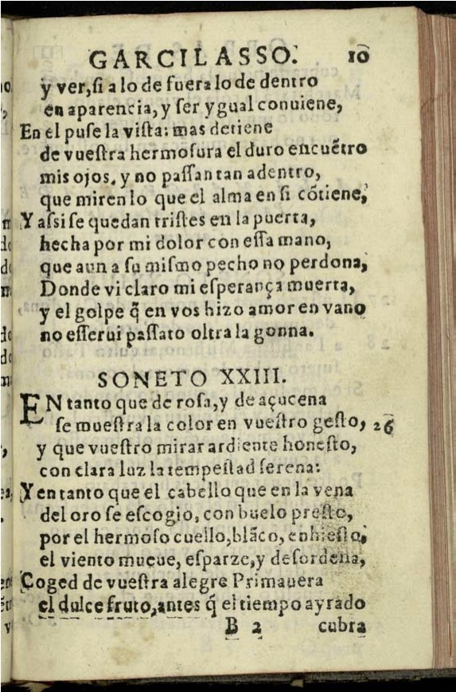

# Codificación de verso y aparato crítico (Garcilaso)

A partir de los materiales vistos en el curso y de los recursos recomendados, debéis llevar a cabo la codificación del soneto XXIII en las ediciones de 1543, 1580 y 1612. Encontraréis las imágenes más abajo. 

Deberéis estructurar todo el documento en función de las secciones de vuestros textos, crear una lista de las ediciones y otorgarles un identificador. 

Elementos a utilizar, como mínimo: `<lg>`, `<l>`, `<rhyme>`, `<listWit>`, `<witness>`, `<app>`, `<lem>`, `<rdg>`. 

Además, puedes describir la fuente primaria con elementos como: `<abbr>`, `<add>`, `<del>`, `<orig>`, `<reg>`, `<fw>`, etc. 

Las obras de Boscán y algunas de Garcilasso de la Vega repartida en quatro libros, Barcelona, Carles Amorós 1543, f. CLXXv (Disponible en [Biblioteca Virtual Miguel de Cervantes](http://www.cervantesvirtual.com/obra-visor/las-obras-de-boscan-y-algunas-de-garcilasso-de-la-vega-repartidas-en-quatro-libros--0/html/ffc264be-82b1-11df-acc7-002185ce6064_367.html))

Obras de Garcilasso de la Vega con anotaciones de Fernando de Herrera. Al ilustrísimo i ecelentissimo Señor Antonio de Guzmán, ..., en Sevilla por Alonso de la Barrera 1580, f. 174 (Disponible en [Biblioteca Virtual Miguel de Cervantes](http://www.cervantesvirtual.com/obra-visor/obras-de-garcilasso-de-la-vega--0/html/ff83d41a-82b1-11df-acc7-002185ce6064_176.htm))

Obras del Excelente Poeta Garcilaso de la Vega con notas del Brocense, En Madrid por Juan de la Cuesta, 1612, f. 10r-10v. http://www.cervantesvirtual.com/obra/obras-del-excelente-poeta-garcilasso-de-la-vega--0/ 

