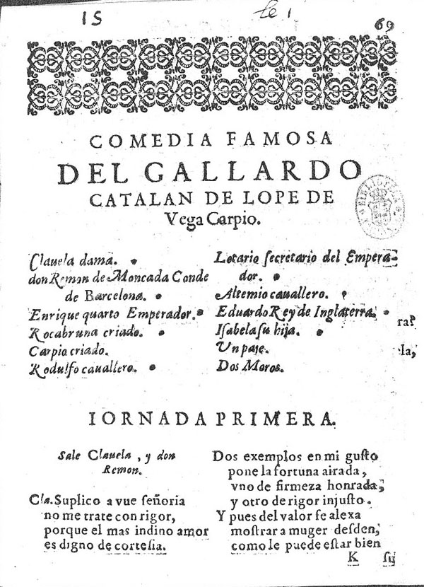
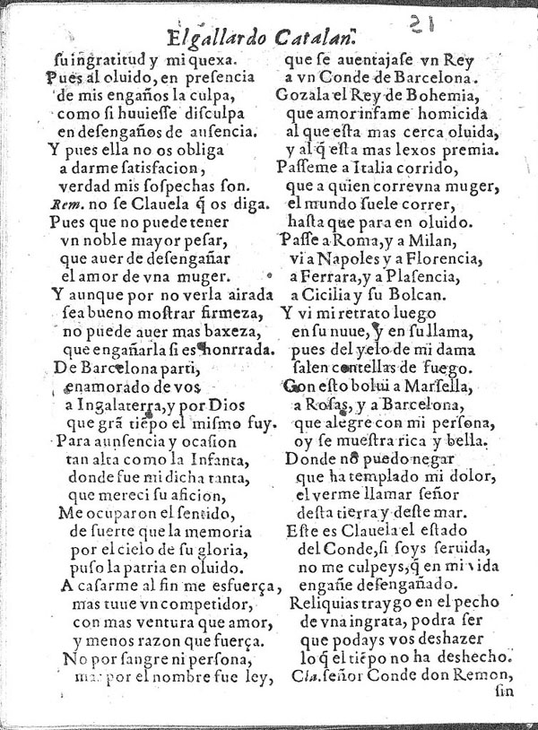

# Codificación de texto dramático y fuente primaria (Lope de Vega)

En este ejercicio debes llevar a cabo la codificación de estas dos primeras páginas que corresponden a la obra teatral de Lope de Vega, *El Gallardo catalán*, publicada en la *Segunda parte de las Comedias* de Lope de Vega Carpio, Madrid, por Alonso Martín, a costa de Alonso Pérez, 1610 y disponible en la [Biblioteca Miguel de Cervantes](http://www.cervantesvirtual.com/obra-visor/el-gallardo-catalan--1/html/). Encontrarás las imágenes más abajo y siguiendo los links a las páginas [69r](http://www.cervantesvirtual.com/obra-visor/el-gallardo-catalan--1/html/ff88cee8-82b1-11df-acc7-002185ce6064_2.html) y [69v](http://www.cervantesvirtual.com/obra-visor/el-gallardo-catalan--1/html/ff88cee8-82b1-11df-acc7-002185ce6064_3.html).

Debes estructurar todo el documento en función de las secciones del texto, crear una lista de personajes y otorgarles un identificador.

Los elementos que obligatoriamente debéis utilizar son: `<sp>`, `<speaker>`, `<stage>` con los atributos vistos en el módulo.

Además, puedes describir la fuente primaria con elementos como: `<abbr>`, `<add>`, `<del>`, `<orig>`, `<reg>`, `<fw>`, etc.

Aquí van las pistas, paso a paso, que te ayudarán a completar el ejercicio:

**[Paso 1]** Cread un documento XML-TEI (con el programa Oxygen) (podéis seguir las mismas indicaciones que [aquí](https://tthub-repo.github.io/ejercicios/3.Creacion-doc-tei)).

**[Paso 2]** En el elemento `<teiHeader>` tendréis que añadir las siguientes informaciones:

- `<title>`: título del ejercicio "Codificación de texto dramático y fuente primaria (Lope de Vega)"
- `<author>`: irá vuestro nombre al que podéis añadir un `@xml:id` en caso que intervengáis como editores.
- `<publicationStmt>`: las informaciones sobre dónde se ha realizado la codificación del archivo (UNED, 2020).

**[Paso 3]** En `<sourceDesc>` debe aparecer la fuente original en la que se basa vuestra edición. Para ello, sugiero que utilices el siguiente esquema:

```
<bibl>
	<author></author>
	<title></title>
	<pubPlace></pubPlace>
	<publisher></publisher>
	<date></date>
	<biblScope></biblScope>
</bibl>
```
Podéis también añadir la indicación de la versión digital, distinguiendo un `<bibl type="impreso">` y uno de copia digital `<bibl type="digital">`con la referencia a la Biblioteca Miguel de Cervantes.

**[Paso 4]** En `<text>` puede añadirse el elemento `<front>` y la lista de personajes que intervienen en la obra, con `<castList>`. Aquí encontraréis más información <https://tei-c.org/release/doc/tei-p5-doc/en/html/examples-castList.html>. Cada uno de los personajes, debe ir marcado con un elemento `<castItem>`: el nombre propiamente dicho puede ir en `<role>` con un `@xml:id`, mientras que la explicación puede ir en <roleDesc>. Por ejemplo:

```
 <castItem>
     <role xml:id="Clavela">Clavela</role>
     <roleDesc>Dama</roleDesc>
 </castItem>
```

**[Paso 5]** En el `<body>`, puede situarse una `<div>`que recoja todo el contenido de la jornada 1. Las indicaciones escénicas pueden ir marcadas con `<stage>`. Por ejemplo, `<stage type="entrance">Sale Clavela y don Remón</stage>`.

**[Paso 6]** El resto de la codificación debería ser de este modo indicando quien habla y especificando la estructura poética:

```
<sp who="#Clavela">
   <speaker>Clavela</speaker>
   <lg type="cuarteto" n="1">
       <l n="1"> ....</l>
       <l n="2"> ....</l>
   </lg>
</sp>
```
**[Paso 7]** Lo ideal es que mientras vayáis codificando os aseguréis que vuestro documento está bien formado y es válido, para ello os ayuda el sistema que explciamos en el [ejercicio 3](https://tthub-repo.github.io/ejercicios/3.Creacion-doc-tei) (Pasos 4 y 5).

## Reproducciones:



